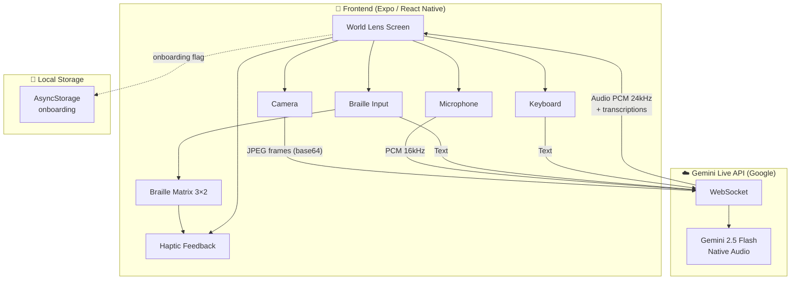
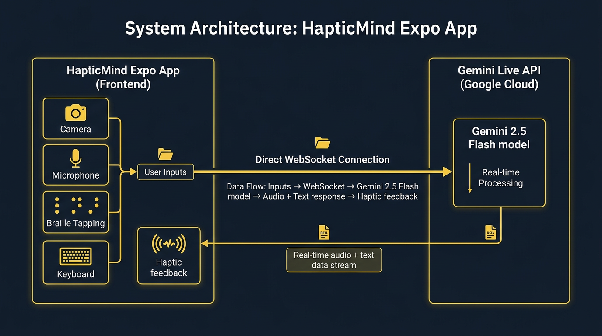

# HapticMind – System Architecture

## Overview

HapticMind is a mobile app (iOS/Android/Web) that uses **Gemini Live API** for visual assistance with haptic Braille communication. The app connects **directly** to Google's API – there is no custom backend or database.

---

See **[project-description.md](./project-description.md)** for the full Project Description (features, technologies, data sources, findings and learnings).

---

## Architecture Diagram



---

## System Components

### 1. Frontend (Expo)

| Element    | Technology                | Description                             |
| ---------- | ------------------------- | --------------------------------------- |
| Framework  | Expo SDK 52, React Native | Cross-platform: iOS, Android, Web       |
| Navigation | Expo Router               | Screens: Splash → Tutorial / World Lens |
| Styling    | NativeWind (Tailwind)     | Consistent UI                           |
| Haptics    | expo-haptics, Vibration   | Braille vibrations on device            |

### 2. Input Sources

| Mode           | Flow                                | Format                            |
| -------------- | ----------------------------------- | --------------------------------- |
| **Microphone** | Hold-to-speak                       | PCM 16 kHz, 16-bit, mono → base64 |
| **Camera**     | Continuous stream (~1.5 s interval) | JPEG base64                       |
| **Braille**    | Short/long taps on 3×2 matrix       | Text (Braille → ASCII encoding)   |
| **Keyboard**   | Text input                          | Text                              |

### 3. Gemini Live API

| Aspect        | Details                                                   |
| ------------- | --------------------------------------------------------- |
| Protocol      | WebSocket (`wss://generativelanguage.googleapis.com/...`) |
| Model         | `gemini-2.5-flash-native-audio-preview-12-2025`           |
| Input         | PCM audio, video frames, text                             |
| Output        | TTS audio (Puck voice), text transcriptions               |
| Configuration | VAD disabled – manual activityStart/activityEnd signals   |

### 4. User Output

1. **Audio** – playback of AI responses (WebAudio / native player)
2. **Text** – displayed on screen
3. **Haptic Braille** – each letter of the response is converted to a Braille pattern (6 dots) and played via haptics/vibration with row-scan animation

---

## Data Flow

```
[User] → [Input Source] → [GeminiLiveService] → [Gemini WebSocket]
                                                      ↓
[Haptics + Audio + Text] ← [gemini-live.tsx] ← [Gemini Response]
```

- **No backend** – WebSocket connection is direct from the app to Google
- **API Key** – `EXPO_PUBLIC_GEMINI_API_KEY` in `.env` (client-side)
- **Local data** – only `AsyncStorage` (e.g. onboarding flag)

---

## Key Files

| Path                           | Role                                                 |
| ------------------------------ | ---------------------------------------------------- |
| `services/gemini-live.ts`      | WebSocket service to Gemini Live API                 |
| `app/gemini-live.tsx`          | World Lens screen – UI, audio, Braille orchestration |
| `utils/gemini-media-native.ts` | Native audio streamer and player                     |
| `utils/gemini-media-web.ts`    | Web audio streamer and player                        |
| `constants/braille.ts`         | Character ↔ Braille pattern mapping                  |

---

## Proof of Google Cloud Deployment

As required for judging: this project uses **Google Cloud / Google AI services** (Gemini Live API) for real-time multimodal AI. Proof of deployment:

**(2) Link to code demonstrating Google Cloud API usage:**

- **[services/gemini-live.ts](./services/gemini-live.ts)** – WebSocket client connecting to `wss://generativelanguage.googleapis.com/ws/google.ai.generativelanguage.v1beta.GenerativeService.BidiGenerateContent`. This file contains all API calls to the Gemini Live API (Vertex AI / Generative Language API), including setup, audio streaming, video frames, text input, and response handling.

---

## Diagram – Image Version

For easy access in carousel / contest file upload:


